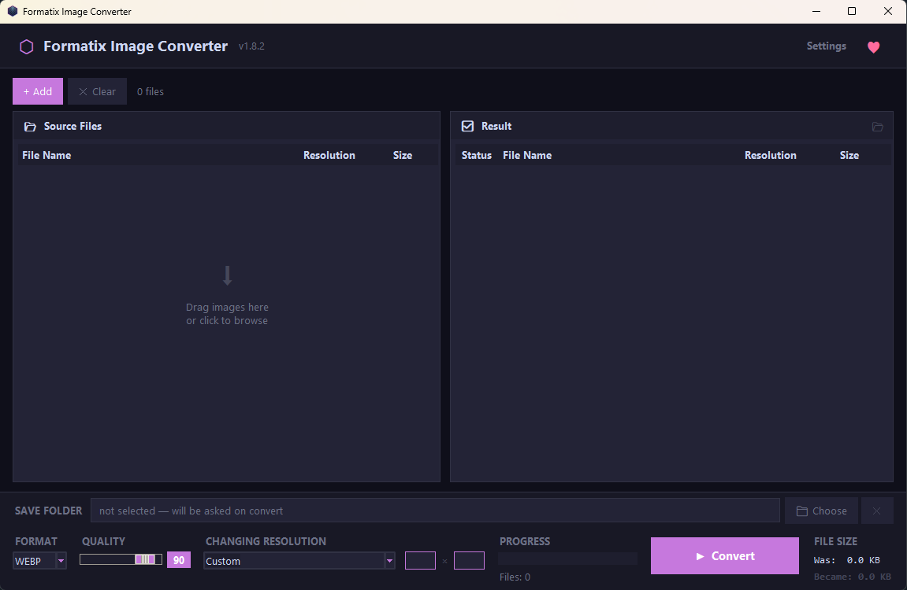

# Formatix Image Converter

Formatix is a desktop batch image converter built for speed and simplicity. Convert entire folders between WEBP, JPEG, PNG, ICO and more — with resize, crop, and quality control — in just a few clicks.



---

## Features

- **Batch conversion** — add hundreds of files at once, convert in one click
- **6 output formats** — WEBP, JPEG, PNG, BMP, TIFF, ICO
- **5 resize modes:**
  - No change
  - Proportional by width
  - Proportional by height
  - Smart crop (fill exact dimensions, center-cropped)
  - Custom (free width × height, no aspect ratio lock)
- **ICO export** — automatically generates a full multi-size icon pack (16, 24, 32, 48, 64, 128, 256 px) in a single `.ico` file
- **Quality control** — adjustable quality slider for JPEG and WEBP (disabled automatically for lossless formats)
- **Drag & Drop** support (requires `tkinterdnd2`)
- **Conversion cache** — re-converting with the same settings skips already processed files instantly
- **Atomic file writes** — files are never left in a half-written state
- **Overwrite protection** — warns before replacing existing files, with per-session confirmation
- **File size stats** — shows original vs. converted size after each batch
- **5 interface languages** — English, Русский, Українська, Deutsch, 中文
- **Auto language detection** — picks your system language on first launch (Windows UI language via LCID)
- **Remember settings** — optionally saves format, quality and resize mode between sessions
- **High DPI aware** — crisp rendering on scaled displays

---

## Requirements

- Python 3.8+
- [Pillow](https://pypi.org/project/Pillow/)

```bash
pip install pillow
```

Optional (for drag & drop):

```bash
pip install tkinterdnd2
```

---

## Running

```bash
python formatix.py
```

No installation, no setup. Just run.

---

## Supported Input Formats

`.jpg` `.jpeg` `.png` `.webp` `.bmp` `.tiff` `.tif` `.gif` `.ico`

---

## Output Formats

| Format | Compression | Quality slider | Notes |
|--------|-------------|----------------|-------|
| WEBP   | Lossy       | ✅             | Best size/quality ratio |
| JPEG   | Lossy       | ✅             | RGBA auto-converted to RGB |
| PNG    | Lossless    | —              | |
| BMP    | None        | —              | |
| TIFF   | Lossless    | —              | |
| ICO    | Lossless    | —              | Multi-size pack, max 256×256 |

---

## Settings

Settings are stored in `~/.formatix_image_converter_settings.json`.

You can enable or disable settings persistence in the Settings window — when disabled, the app always starts with default values (the language preference is always remembered regardless).

---

## ☕ Support the Author

If Formatix saved you time or effort, a small donation is always appreciated.

| Network      | Address |
|--------------|---------|
| Bitcoin      | bc1q8ajkfe5zg26ugwthjlcjqtn06dveh3kehted90 |
| Ethereum     | 0x08bDC7b9d6f400260973B73063Eb81c27A10f1e3 |
| USDT TRC20   | TU2RZTdh8p2fEt2hnKrUTAZNj8trfW6hYE |
| Solana       | 4VAPnL62M7o8SwrYHhE8ZSpHqDM8qvkqCjL4EKaAFj58 |
---

## License

[GPL-3.0](https://github.com/cyber-anderson/Formatix?tab=GPL-3.0-1-ov-file#)
